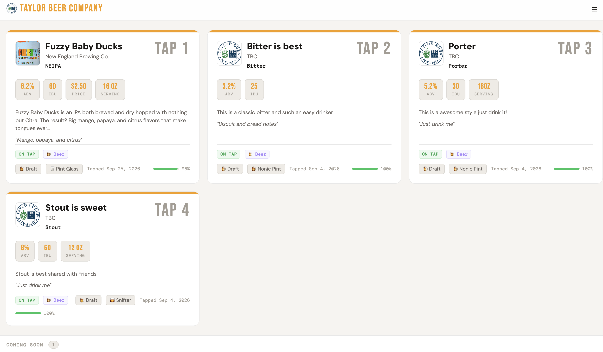

# 🍺 Tap Menu: Self-Hosted Digital Draft List

<!--
  Replace OWNER below with your GitHub username/org once this is pushed,
  so the badges and image references point at the right place.
-->
[](https://github.com/ipv6tech/tapmenu/actions/workflows/docker-publish.yml)
[](LICENSE)

A self-hosted digital menu for your home taproom, bar, or kegerator setup. Features a full-screen display view, mobile-friendly menu, and an admin panel to manage everything.




---

## Features

- **📺 Display View** — Full-screen menu for a TV or monitor behind the bar, with Grid, Large Card, and List layouts (all sharing the same fields, so switching layouts never hides information)
- **📱 Mobile Menu** — Tap-friendly menu guests can scan via QR, matching the fields/formatting of the display view
- **⚙️ Admin Panel** — Add, edit, delete taps with a clean drawer UI; click any row in the taps table to edit it directly
- **🍺 All Beverage Types** — Beer, mead, cider, seltzer, wine, cocktails, spirits, kombucha, cold brew, and more
- **📊 Keg Level Tracking** — Visual keg gauges with color indicators
- **🔗 Untappd Links** — Link any tap directly to its Untappd page
- **📱 QR Codes** — Auto-generated per tap; scan to see full tasting notes
- **🍻 Brewfather Integration** — Fetch batches by status (Planning/Brewing/Fermenting/Conditioning/Completed), import single or bulk, and sync individual taps or all linked taps; batch status maps automatically to tap status
- **🖼️ Logo & Beer Images** — Upload a logo or per-tap beer image directly (or use a URL); uploads persist across container rebuilds, and the logo can double as the browser tab favicon
- **🎨 Theming** — Dark, Light, or Auto (follows the device/browser preference) — plus a custom accent color and an optional custom CSS override
- **🏷️ Header Options** — Collapse the establishment name/tagline area when empty, or replace the brewery name with a (size-configurable) logo across the nav bar and display page
- **👁️ Field Visibility Toggles** — Show/hide ABV, IBU, price, keg level, style, producer, category, serve method, glassware, tasting notes, description, serving size, and tapped date, independently
- **🔌 Brewing Software Fields** — Brewer's Friend and Grainfather batch ID fields exist in the schema (sync logic not yet implemented — PRs welcome)
- **🔒 Auth** — Simple password-protected admin panel

---

## Quick Start (Docker)

### 1. Clone / download this project

```bash
git clone <your-repo> tap-menu
cd tap-menu
```

### 2. Edit the session secret

Open `docker-compose.yml` and change:
```yaml
SESSION_SECRET=change-me-to-a-long-random-string
```
to something random and secure.

### 3. Start it up

```bash
docker compose up -d
```

### 4. Open the app

- **Display / Menu:** http://localhost:3000
- **Admin panel:** http://localhost:3000/admin

On first visit to `/admin`, you'll be prompted to create your admin account.

---

## Run the Published Image (GHCR)

Instead of building locally, you can pull a pre-built image published to GitHub Container Registry on every tagged release:

```bash
docker run -d \
  --name tapmenu \
  -p 3000:3000 \
  -v tapmenu-data:/data \
  -e SESSION_SECRET=change-me-to-a-long-random-string \
  ghcr.io/ipv6tech/tapmenu:latest
```

Or point `docker-compose.yml`'s `build: .` at `image: ghcr.io/ipv6tech/tapmenu:latest` instead. Images are built for both `linux/amd64` and `linux/arm64` (Raspberry Pi, Apple Silicon, etc.), tagged by version (`:1.2.3`, `:1.2`, `:1`) plus a rolling `:latest`.

---

## Ports & Networking

By default the app runs on port **3000**. To change it, edit `docker-compose.yml`:

```yaml
ports:
  - "8080:3000"   # access on port 8080 instead
```

### Behind a Reverse Proxy (Traefik / Nginx / Caddy)

The app runs on HTTP. Put your TLS termination at the reverse proxy level. Example Traefik label:

```yaml
labels:
  - "traefik.http.routers.tapmenu.rule=Host(`taps.yourdomain.com`)"
  - "traefik.http.services.tapmenu.loadbalancer.server.port=3000"
```

---

## Data Persistence

All data is stored in a SQLite database at `/data/taproom.db` inside the container, plus an `/data/uploads` directory holding any uploaded logos and beer images — both live on the same Docker named volume (`tapmenu-data`), so they persist across container restarts, rebuilds, and updates.

To back up (database + uploads):
```bash
docker cp tapmenu:/data ./tapmenu-backup
```

To restore:
```bash
docker cp ./tapmenu-backup/. tapmenu:/data
docker restart tapmenu
```

---

## Environment Variables

| Variable | Default | Description |
|---|---|---|
| `PORT` | `3000` | HTTP port |
| `SESSION_SECRET` | `tapmenu-secret-...` | **Change this!** Cookie signing secret |
| `DB_PATH` | `/data/taproom.db` | SQLite database path |
| `UPLOADS_DIR` | directory of `DB_PATH` + `/uploads` | Where uploaded logos and beer images are stored |

---

## Updating

```bash
docker compose pull   # if using a registry
docker compose build  # if building locally
docker compose up -d  # restarts with new image, data preserved
```

---

## URL Structure

| Path | Description |
|---|---|
| `/` | Full-screen display view |
| `/menu` | Mobile-optimized menu |
| `/admin` | Admin panel |
| `/tap/:id` | Individual tap detail (linked from QR codes) |

---

## Brewfather Integration

Add your Brewfather User ID and API Key under Settings → Integrations. From there you can:

- **Fetch Batches** by status (single status, a preset combo, or "All batches") — each status is queried separately under the hood, since Brewfather's API only filters by one status per request
- **Import** a single batch or bulk-import several at once
- **Sync** an individual linked tap or all linked taps, refreshing name/style/ABV/IBU/description/status from Brewfather

Batch status maps to tap status automatically: Planning/Brewing/Fermenting/Conditioning → *Coming Soon*, Completed → *On Tap*, Archived → *Kicked*.

Brewer's Friend and Grainfather batch ID fields exist in the schema and admin form, but there's no sync logic for them yet — PRs welcome!

---

## Development

```bash
npm install
npm run dev   # uses nodemon for hot reload
```

App runs at http://localhost:3000

---

## Tech Stack

- **Backend:** Node.js + Express
- **Database:** SQLite via [sql.js](https://sql.js.org) (WASM), persisted to a single file on disk
- **Uploads:** Multer, stored alongside the database for persistence across rebuilds
- **Frontend:** Vanilla JS SPA (no build step)
- **Fonts:** Bebas Neue + DM Sans + DM Mono
- **QR:** qrcode npm package
- **Auth:** express-session + bcryptjs

---

## Contributing

Issues and PRs are welcome — this is a small self-hosted project, so keep changes focused and test them against a real Docker rebuild before submitting (see `docker compose build && docker compose up -d`). There's no formal test suite yet; that's a good place to contribute too.

---

## License

[MIT](LICENSE) — do whatever you want with it, just keep the copyright notice.
